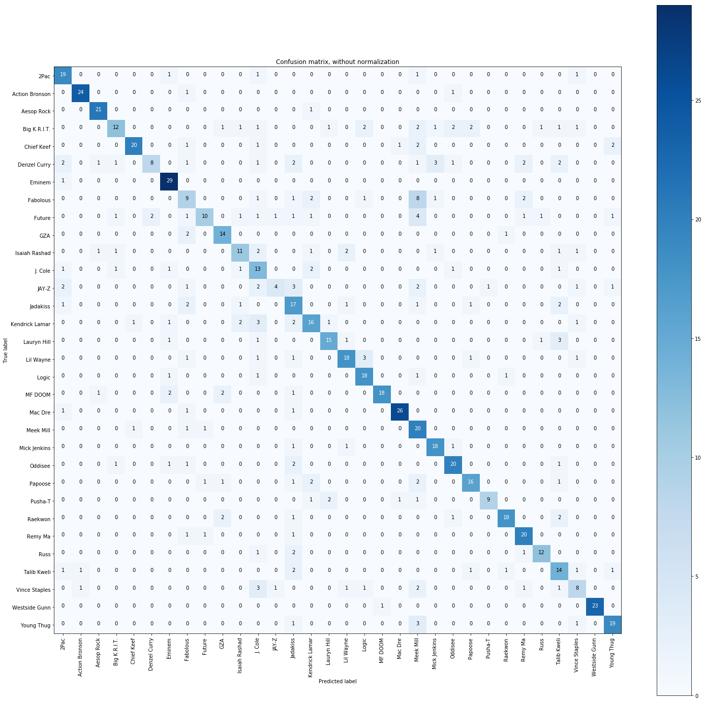

# LyricSmash
A ML notebook project that analyzes hip hop lyrics.  
Uses Naive Bayes to extract word usage patterns of hip hop artists.  
The intention of this project was to try to make a model that could determine  
the artist of a song using its lyrics.  

Here's a link to check out the notebook: https://mybinder.org/v2/gh/Gohsato/LyricSmash/master?filepath=mulitnomial_bayes.ipynb

The data presented contains lyrics from 32 artists obtained using the Genius API.  

The final accuracy of the model was roughly 65-70%.

While creating the model I also extracted some other interesting insights that can be seen
by opening the notebook.  

Here's my favorite. It compares the predictions and the true values.  
You can see what artists are similar as well as which artists are unique.       

